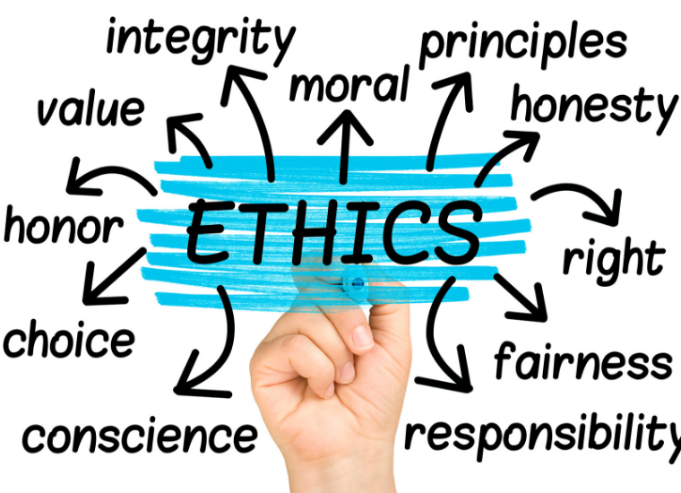
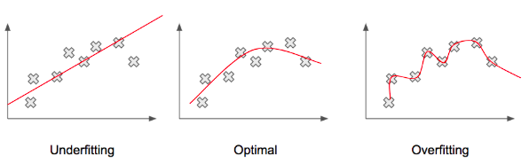
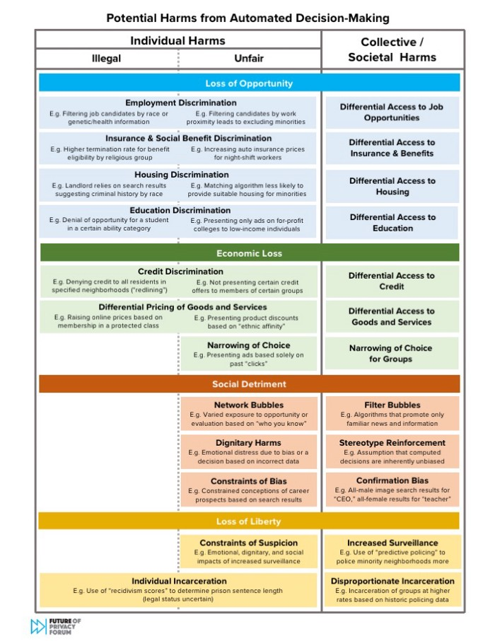
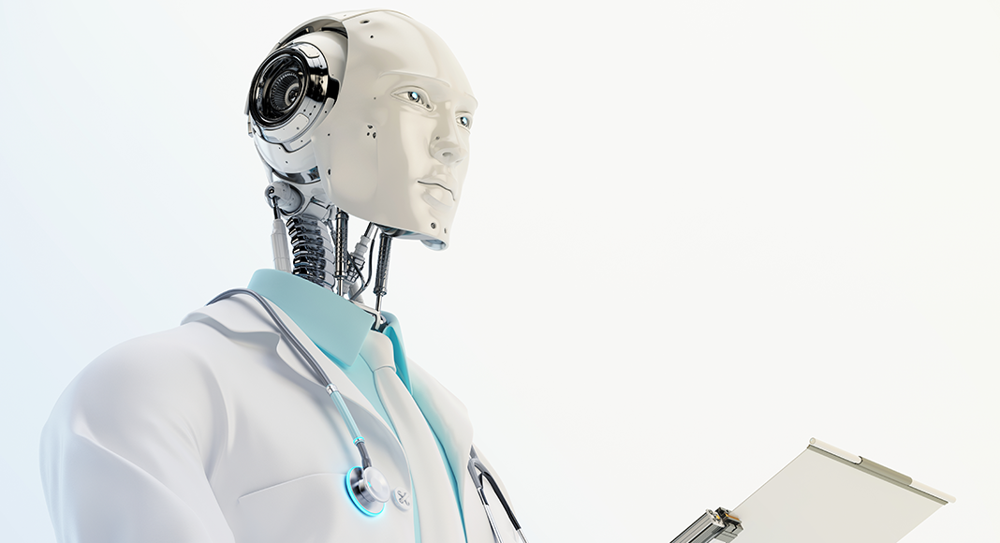
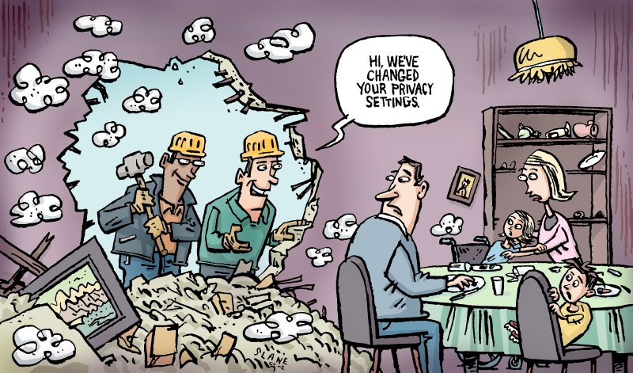

# Intro to Ethics {#introduction-relevance-ethics status=ready}

##### What is Ethics? 

The term ethics comes from the word "ethos", which is Greek for "way of living".
 
When there is a difficult situation, there are multiple possible solutions. Ethics consists of moral principles and values of a person or a group of people. It affects how we choose to live our lives, what we think is wrong and right in morals and situations, and what our responsibilities are.

<figure>
    <figcaption>Ethics (Image: scu.edu)</figcaption>
    
</figure>

By considering ethics during decision making, we can make better decisions that would benefit individuals and society as a whole.
 
Specifically for ethical issues that are related to AI, they can be split into different categories.
 
**The Ethical Implications of What AI Is**
 
_Bias and Fairness:_

AI systems are being used more and more to simulate real life situations and tasks. In doing so, AI may be capable of amplifying human biases. 
<!-- https://towardsdatascience.com/the-hitchhikers-guide-to-ai-ethics-part-2-what-ai-is-c047df704a00 --> 
<!-- https://www.borealisai.com/en/blog/tutorial1-bias-and-fairness-ai/ -->

This may be the cause of biased data. However, another large focus of bias may be from the process of creating a machine learning models. A single math equation is unable to perfectly represent all the data, so a math equation that gets as close as possible is used. In this process, the bits of data that originally had the largest representation would be altered the least by the final math equation. But others, would get ignored by the model, which ends with unfair representation (TowardsDataScience). 

<figure>
    <figcaption>Optimal Line Vs Squiggly for Machine Learning Models (Image: pythonmachinelearning.pro)</figcaption>
    
</figure>

Now what is "fairness"? 

<figure>
    <figcaption>But what is right and wrong? (Image: Machine Learning, XKCD)</figcaption>
    
</figure>

There is not a specific definition for the term "fairness". It is a challenge that we are always striving towards: trying to create an autonomous system that is fair. To create a model that is fair, large understanding of many factors is required such as cultural, social, historical, political, legal, and ethic considerations. Many of these require tradeoffs to be made. Should every group of people be given the same amount of benefits or should each group's given benefit be proportional to their situations? For different situations, it is always a difficult question and many have debates about what exactly is fair in a situation and who should be responsible for calling the final decision (Google). 

<!-- https://ai.google/responsibilities/responsible-ai-practices/?category=fairness -->  

_Accountability and Remediability:_

We know that there is always the chance that algorithms can create biased outcomes. Therefore, systems must be held accountable when this does occur. This can be done multiple ways, whether through getting humans to investigate the systems, assess impacts on users, or established policies. 

And what does happen when there is damage due to these systems and their biased outcomes? It would ideally be great if there are established policies or regulations that deal with this, but as of now, there are none. Currently, efforts have been taken by journalism and research teams to identify systems that are biased and push them to take action to resolve them (TowardsDataScience).

_Transparency, Interpretability, and Explainability:_

Many ethical issues arise because of lack of transparency, interpretability, and explainability. 

Companies do not want to share their ideas, algorithms, and their models, which makes them reliant on data that is close sourced. This is due to multiple reasons: eliminate competition with other companies in related industries, and reduce hacking or malicious usage of their systems. However, this also prevents others from being able to identify possible sources of bias or inaccuracy in their systems. 

Also, machine learning algorithms and models often require very complex math and multiple layers of it. This is because we want the math to be as close as possible to data patterns that are seen. Because of how complex it is, it is difficult for others to understand or explain on a detailed level how everything works (TowardsDataScience). 

**The ethical implications related to what AI does**
 
_Safety:_ 

<figure>
    <figcaption>Examples of harms of AI systems and algorithmic decision making (Image: Future of Privacy Forum Report)</figcaption>
    
</figure>

We want AI systems to be as safe as possible through decreasing the risk of bias, the risk of bodily harm, or display any behavior that can harm others. 

AI systems are responsible for replicating functions of decision making skills of human minds. This involved having the ability to make decisions based on our ethics, intentions, and logical consequences that change depending on the situation and scenario. 

_Human-AI interaction:_ 

<figure>
    <figcaption> Automatic robots could be the future of nursing? (Image: ActiveAdvice)</figcaption>
    
</figure>

While AI systems are made to replicate human minds or be able to do human tasks, there are many things that differentiate these systems from humans. However, as AI systems improve over time, these differences may become smaller and smaller, and can  cause harm or provide benefits to people who use them.  

_Cyber-security and Malicious Use:_ 

AI is becoming better and better at detecting, preventing hacks, and is now being used in many other systems as a cybersecurity measure. However it is still at a large risk of being hacked by others or used by others for malicious intent. This is due to the nature of AI, how it relies on input data and is constantly online for others to use 24/7, and many other reasons. Input data can be altered, others can constantly hack and alter key components of the algorithms through web packets or through the internet. 

_Privacy, Control, and Surveillance:_

<figure>
    <figcaption>Technology can be a break down the walls of privacy (Image: Slane Cartoons Ltd)</figcaption>
    
</figure>

AI systems can be quite easily converted for the purpose of surveillance. While it can be used for public good, naturally we would like to know exactly where and when our data will be used. But the catch here with AI systems is that others may be using our private data without our permission. AI systems learn from data provided during training, and they make predictions based on data input that they receive. The data may regard extremely sensative or important data. There must be measures put in place so that the data can be used safely and efficiently by the system, while preventing the visibility of it from prying eyes. 

 
##### Correctness and Uncertainty of Algorithms
 
By incorporating artificial intelligence (AI) into systems, they gain the potential to accomplish tasks that usually rely on the intelligence of humans. Systems can become autonomous, and do not have to rely on human control and decisions. An example of an autonomous system that is currently developing is autonomous cars.
 
AI systems utilize Deep Learning (DL) and Machine Learning (ML), which both rely on data matching and analysis algorithms, allowing the systems to replicate intelligence of human brains and enabling them to learn without human guidance.
 
There are benefits of using AI and autonomous systems and the use of algorithms in decision making processes.
 
Decisions can be made with more clearer and transparent criteria and choices will be less influenced by human emotions. The systems can learn from past actions and decisions that have been chosen and can analyze the consequences that resulted. If a result was non-favorable, then the system will remember and avoid picking the same choice for a similar future situation.
 
There are also disadvantages to autonomous systems or relying on algorithms to make decisions.
 
The algorithms may not represent all the factors that are related to a situation. There is also always chances that unexpected consequences will happen. There is no guarantee that a choice that had beneficial results in the past will still have the same result in the current scenario.
 
Also, the way that AI systems learn and their actions may become more unpredictable as they are given more complicated tasks that require more decision making skills (Yampolskiy).
 
#### Example: Husky Vs Wolf In Image Identification
 
University of Washington wanted to create an image classifier that can identify wolves from huskies correctly. The AI systems were fed images to learn from. However, some photos of huskies are incorrectly categorized by the system as wolves. It turns out that the system was learning from the images that wolves are often found in images that had snowy backgrounds. So the system turned out to be simplying identifying if images had snow in the background (Medium).
 
When there was a wolf in an image with no snow in the background, it would be categorized as a husky. If there was a husky with a snowy background, it would be categorized as a wolf (Ribeiro et al.).
 
This inaccuracy of the system is because of a data set that was "unfair" or did not have a sufficient variety of scenarios (Besse et al.).
  
#### Example: Artificial Neural Network to predict risk of pneumonia patients
 
University of Pittsburgh created a study in the 1990s to use a system to predict which pneumonia patients were low risk and which were at high risk. The system initially caused a large amount of concern to doctors because they found out that pneumonia patients with asthma was classified as low risk by the system. A rule system was implemented into the system to help solve this issue. After examining data closely, researchers founds that patients who had both pneumonia and asthma had a higher recovery rate. This is because when those patients were brought to the hospital, they were always considered to be at high risk, and immediately received proper treatment. However, the autonomous system simply believed that the presence of asthma results in being low risk, which is incorrect (Medium).
 
 
#### Example: The Boeing 737 MAX.
 
 
There have been a number of accidents with the Boeing 737 MAX aircraft, which has resulted in the grounding of Boeing 737 MAX worldwide.
 
1. Lion Air Flight 610: domestic flight that took place on October 29, 2018. It crashed into the Java Sea shortly after takeoff. Resulted in deaths of all 189 passengers and crew.
 
2. Ethiopian Airlines Flight 302: international flight that took place on March 10, 2019. It crashed shortly after takeoff, and resulted in deaths of all 157 people on the flight. 
 
 
Teachers explain why MCAS was added and how the MCAS and a faulty sensor contributed to the grounding of the Boeing 737 MAX.
 
There were several reasons that contributed to these fatal accidents:
 
The Boeing 737 Max 8 is different from the earlier Boeing 737 series. To allow for expanded seating capacity and better engines, Boeing 737 Max 8 had major design changes. The engines were moved forward and were raised. However, this made it more likely for the nose to pitch up while flying, so Maneuvering Characteristics Augmentation System or MCAS was developed to help correct the nose pitching problem by altering the control surface at the tail. The algorithm automatically detects whenever the nose pitches too high and corrects it (Seattle Times).

 
MCAS relies on only a single angle of attack sensor, instead of two. An angle of attack sensor helps warn pilots of a possibility of them losing control of the plane due to lack of lift (causing stall). Pilots are usually able to handle when the sensors are malfunctioning, however MCAS makes it a much larger problem. In both of the fatal accidents, MCAS was automatically switched on because of incorrect data from the single sensor (The Washington Post).
 
 
Pilots can temporarily switch MCAS off, however the system will restart and continue to work if the sensor continues to warn pilots of stalls. MCAS cannot ever been overriden by the pilots. The pilots lost control of the plane during the Ethiopian Airlines and Lion Air flights as the system was continuously fed inaccurate data from the sensor indicating that there are stalls, and they were unable to pitch up when needed, causing both flights to dive into the sea (The Verge).

 
Other flaws also contributed to the incident: 
 
1. Insufficient testing:
 
Boeing and FAA agreed to not install safety features, which analysts say later that these features could have saved both the planes from crashing (The Washington Post).
 
<!-- https://www.washingtonpost.com/local/trafficandcommuting/boeing-minimized-to-faa-the-importance-of-flight-control-system-implicated-in-737-max-crashes-new-report-says/2020/07/01/9900adda-bba4-11ea-8cf5-9c1b8d7f84c6_story.html-->
2. Accountability:
 
Boeing did not provide the risk assessment about the MCAS until very late, a couple of months before the MAX was certified. FAA also based on findings by Boeing that were inaccurate (The Washington Post).
 
3. Lack of notice to pilots:
 
During their findings, Boeing calculated that an MCAS failure was also impossible. If it did happen, it is believed to be relatively low risk because according to the FAA, it is assumed that pilots can respond to unexpected situations within three seconds (Seattle Times).
 
Because of the low chances that were predicted, Boeing decided to not include the MCAS in the pilot manuals (Seattle Times).
 
<!--https://www.seattletimes.com/seattle-news/times-watchdog/the-inside-story-of-mcas-how-boeings-737-max-system-gained-power-and-lost-safeguards/ -->
 
##### Algorithmic Bias
 
Teachers teach that algorithmic bias can result from multiple sources.
 
1. The algorithm may be programmed by someone who is biased thus inheriting their biased views.
 
2. Since the systems often rely on pattern matching algorithms, an algorithm may act in a biased way because data that comes from biased sources.
 
3. The dataset given to the system to learn from could have biases that the developer is unaware of. Regarding the point made before regarding algorithmic uncertainty, from the data it receives, robots may unintentionally develop a biased and stereotypical way of thinking while trying to establish which factors it should prioritise during decision making.
 
4. Limitations of the mathematical model for machine learning of the data set. 

5. Developers when testing their AI systems, do not test it with a large variety of data or do not take into consideration certain scenarios (which may come from a lack of diversity in the workplace).
 
 
#### Example: Amazon: Congress Matched to Criminals
 
Teachers teach about another example of algorithmic inaccuracy in AI systems, this one is more applicable to humans.
 
Amazon created Rekognition, which is a facial recognition software. ACLU tested the software by matching Congress members, and the result was shocking: 28 members were matched with criminals. In addition, it was found that 40% of the inaccurate image matches were of people of color (ACLU NorCal). 
 
This is risky to be actually implemented for law enforcememt purposes, as it can make a police officer more biased before an initial encounter, or it can increase the chances of a person being questioned or searched, or can increase bias towards people of color (ACLU NorCal).
 
<!--https://www.aclunc.org/blog/amazon-s-face-recognition-falsely-matched-28-members-congress-mugshots -->
 
#### An example: Autonomous systems and identification by skin tone
 
An autonomous soap dispenser by Technical Concepts was found to have trouble dispensing people for darker skin color. This is because the dispenser relied on IR sensor which relies on how much light is reflected back. Darker skin tones absorb more light than people with lighter skin tones (Reporter). This resulted in the soap dispenser not being able to work for people with darker skin. This design flaw was believed to be because of a lack of diversity in the workplace at Technical Concepts, who did not think to test their products on people with darker skin tones (Reporter).
 
<!-- https://reporter.rit.edu/tech/bigotry-encoded-racial-bias-technology -->
 
According to a study done with autonomous systems by Georgia Institute of Technology, AI systems were more consistently accurately identifying people with lighter skin tones than darker. Their results show that detection of people with darker skins were less accurate by 5%. This can result in racial bias by the algorithm, and in the case of autonomous cars, people with darker skin would be more likely to be harmed or involved in an accident than those with lighter skin.
 
#### Another example: MIT's Moral Machine
 
<!-- done as a game, data set is not entirely reliable -->
 
<!--  internet cyber security/how much trust assumption/use for good or bad are possible ; unintended uses when developing -->
 
Better: Exerise: Try out some of the questions of the Moral Machine here [website](https://ici.radio-canada.ca/info/2019/voitures-autonomes-dilemme-tramway/index-en.html)

- Explain that the Moral Machine focuses on nine different themes
- Note about the correlation between results of the Moral Machine and culture and economics 

See also: Students may read this [article](https://www.technologyreview.com/2018/10/24/139313/a-global-ethics-study-aims-to-help-ai-solve-the-self-driving-trolley-problem/) to learn more about the experiment and findings.

In 2014, MIT has created a series of questions and scenarios that involve autonomous cars and artificial intelligence, which is known as the Moral Machine. The Moral Machine asks people which choices autonomous cars should make when facing different variations of the trolley problem (Technology Review).
 
The Moral Machine focuses on 9 different themes:
 
1) Humans or pets/animals?
 
2) Passengers or pedestrians?
 
3) More or fewer lives?
 
4) Women or men?
 
5) Young or old?
 
6) Healthy or those with health conditions?
 
7) People of those of higher or lower status?
 
8) Action or no action?
 
The results of the Moral Machine was closely related with culture and economics (Technology Review).
 
Students may read this [article](https://www.technologyreview.com/2018/10/24/139313/a-global-ethics-study-aims-to-help-ai-solve-the-self-driving-trolley-problem/) to learn more about the experiment and findings.
 
While this is presented in a very "game" like way, it is very interesting to take into consideration moral concepts that we think about in extreme situations.
 
<!-- https://www.media.mit.edu/projects/moral-machine/overview/
 
https://www.media.mit.edu/publications/the-moral-machine-experiment/
 
https://www.technologyreview.com/2018/10/24/139313/a-global-ethics-study-aims-to-help-ai-solve-the-self-driving-trolley-problem/
 
-->
 
#### Security, on time, backups, as these systems become relied upon
 
There are many systems in society that utilize autonomous systems that are important to society.
There has been ongoing debate whether these systems should be close or open sourced.
 
Open source code means that the source code can be accessed by the public. Closed source code means that the source code cannot be accessed by others, or it remains classified, only seen by those who are authorized to. While closed source codes may safer from prying eyes or hackers, it also prevents closer scrutiny for potential biases or problems in the code by the public.
 
 
#### An example: Autonomous Systems Used in Social Credit System Development in China
 
The Chinese government began experimenting with social credit scores in 2015, when it allowed private companies to assign credit scores to people. One of the companies, Sesame Credit, does this by analyzing many variables over five sets of data, most of which is actually from Alibaba’s Alipay, which is used by over a billion people to make purchases, and contains much information. Sesame Credit analyzes both financial and social behaviors and assigns a score between 350 and 950 (Time). People who accomplish good deeds are awarded points and can receive rewards. Those who do bad deeds, such as smoking or spending too much time on video games, are deducted points. Those with an extremely low social credit score are placed on the “List of Untrustworthy Persons” and will be prohibited from certain activities such as the ability to use public transportation or to make large purchases.
 
This is being implemented with the help of AI and facial recognition.
 
There has been many concerns with the use of China's social credit system, fears about leading to social inequality and alienation. There are also fears of preventing a free market economy. While the benefits include trying to reduce the amount of crimes or bad habits of people.
 
<!--
https://time.com/collection/davos-2019/5502592/china-social-credit-score/
-->
 
#### Correctional offender Management Profiling for Alternative Sanctions (COMPAS)
 
COMPAS is an software that is used by US courts to assign scores to predict the risk of a certain person commiting another crime.
It is an algorithm that utilizes an algorithm that considers answers to a questionnaire (The Atlantic).
 
In 2016, ProPublica has analzyed COMPAS and has found that COMPAS displays bias against African Americans.
 
<!-- https://www.theatlantic.com/technology/archive/2018/01/equivant-compas-algorithm/550646/ -->
 
 
#### An example: Unsecured/Exposed Robots Running on ROS and Internet:
 
A research team at Brown University discovered that they found almost 100 exposed systems that ran on ROS. "Up to 19 were considered to be fully operational robots". They found that they could access the cameras of the robots, and be able to give them commands for movement remotely (Brown University). 
 
This shows how vulnerable systems can be when connected to the internet.
 
<!-- https://www.brown.edu/news/2018-07-24/robots
and https://www.wired.com/story/security-robotics/
-->
 
 
##### Militarization
 
There has been consideration of using autonomous systems for militarization. This could be for making military based decisions or using these systems to take action on made military decisions.
 
 
#### International Traffic in Arms Regulations (ITAR)
 
International Traffic in Arms Regulations (ITAR) specifically covers:
 
1) Covers military items or defense articles 
2) Regulates goods and technology designed to kill or defend against death in a military setting 
3) Includes space-related technology because of application to missile technology 
4) Includes technical data related to defense articles and services 
5) Involves strict regulatory licensing and does not address commercial or research objectives 
 
(Source: Digital Guardian)
 
<!-- https://digitalguardian.com/blog/what-itar-compliance -->
 
#### Example: Predator drones utilized by the United States
 
There have been several predator drones that have been used by the United States Air Force (USAF) and Central Intelligence Ageny (CIA). Initially many are utilized for primarily reconaissance and spying, but many have been later equipped to be able to engage in warfare.
 
#### Should we handle autonomous weapons like chemical weapons
 
In the US, there are two types of chemical warfare agents: stockpiled and non stockpiled.
 
"In 1996, it was mandated that all stockpiles of lethal chemical agents must be destroyed.
 
In 1997, the US ratified Chemical Weapons Convention Treaty and agreed to destory any remaining stockpiles of chemical warfare agents to no later than April 29, 2012" (CDC).
 
There has been much debate if autonomous weapons should be treated like chemical weapons? Should they also be prohibited from use and fully destroyed?
 
<!-- https://www.cdc.gov/nceh/demil/history.htm -->
 
 
##### Medical, Healthcare, and Caregiver Robots
 
Autonomous systems and AI systems have been also considered for usage in the healthcare industry.
 
This includes the uses of robots to help with identification, medical diagnosis, treatment, or surgery.
 
It also includes the uses of robots to help keep elderly, disabled, young children, or patients company and to surpervise them.
 
While there are many benefits such as being able to take care and monitor health of whoever they are responsible for and can provide them with company, there are several ethical concerns:
 
1. Privacy/Security:
 
Robots that spend a lot of time monitoring their patients or people that they are responsible for, may have the capability to be tapped into.
 
Especially in the medical field, these robots may contain snippets of important information such as health records, or video feeds of their patients.
 
2. Trust between robots and humans, and their interactions:
 
Humans have emotions while robots do not. Humans may have the capability to trust their robots too much, which can result in harm from the remote or manipulation of humans.
 
#### The Emergency Exit Robot Study, Georgia Tech Howard
 
There was a study conducted by researchers at the Georgia Institute of Technology, highlighted the potential risks of putting too much trust into robots during emergency situations.
 
They did an experiment that simulated an emergency situation. It was found that all participants of the experiment decided to follow the robot during the emergency, even if it led them through an noticeably incorrect path. Half of the participants have also seen the robot fail at navigating earlier before the specific experiment (Robinette et al.). 
 
<!-- https://www.cc.gatech.edu/~alanwags/pubs/Robinette-HRI-2016.pdf
-->
 
##### Availability/Accessibility/Uses
 
The cost of autonomous systems may be high depending on the purpose of the robot. The high prices of robots currently are barring many people from more complex robots.
 
Robots can be used to help those with accessbility issues.
 
Autonomous systems and advanced technology may also be used to help with emergency aid purposes. Drones can be used to help with potentially locating lost items or people, or helping transport emergency items quickly (water for forest fires ex.).
 
#### UN Guidelines for Emergency Uses of Drones and
 
UAVs have potential in three areas: humanitarian, development, and peacekeeping operations (UN).
 
In 2013, the UN has launched the first UAV mission to help protect civilians in the Democratic Republic of Congo (UN News).
 
Read this [article](https://news.un.org/en/story/2017/09/564452-feature-does-drone-technology-hold-promise-un) for more information: and [article 2](https://news.un.org/en/story/2013/12456942-un-launches-unmanned-surveillance-aircraft-better-protect-civilians-vast-dr)
 
#### Humanitarian Drone Guidelines
 
According to Relief Web, the most promising uses of drones regarding humanitarian purposes include:
1. Mapping

2. Delivering lightweight essential items to remote or hard-to-access locations

3. Supporting damage assessments

4. Increasing situational awareness

5. Monitoring changes
 
 
<!-- https://reliefweb.int/sites/reliefweb.int/files/resources/Drones%20in%20Humanitarian%20Action.pdf -->
 
 
##### Future impact of AI on human jobs and responsibilities
 
With the development of AI, there has been a growing reliance on them as tools in our daily lives.
 
Ethical implications related to what AI can impact:
 
1) Automation, Job Loss, Labor Trends
 
With the automation of many jobs, people may lose those jobs to robots. This may be because some tasks are able to be done more efficiently by robots. Because some jobs are more adaptable to robots than others, this may produce labor trends. There will be new jobs created that are more oriented towards maintaining robots or certain jobs will die out.
 
2) Impact to Democracy and Civil Rights 
 
AI may have a strong impact on democracy and civil rights. AI may be able to automatically detect certain messages or actions that are not permitted and can be used to prevent them. There has been related concerns to that and the Chinese Social Credit System, and fear that it may create a society focused around surveillance and conformity.
 
3) Human-Human or Human-Agent interaction:
 
As explored slightly in the medicine uses of robots, there will be much more interactions between human and non humans/robots in the future, which is different from interactions between humans only.

 

