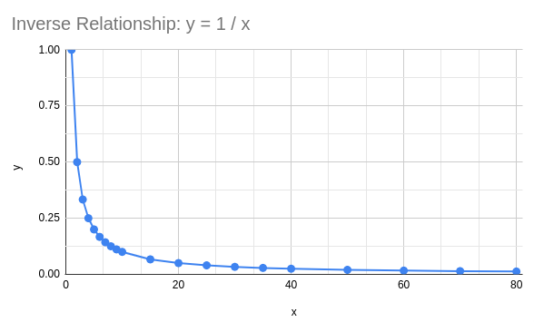
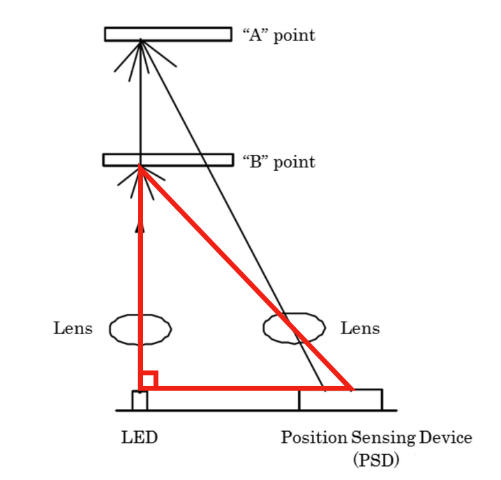
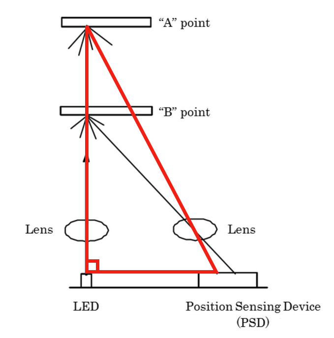
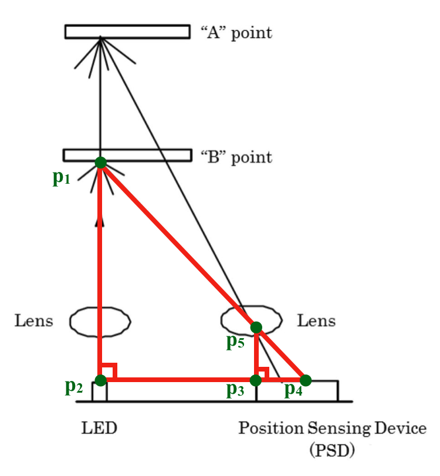
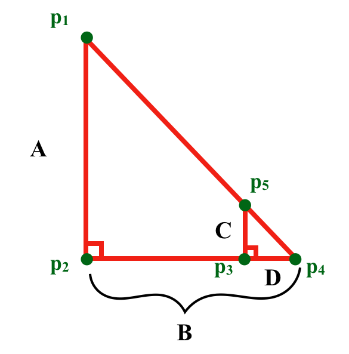
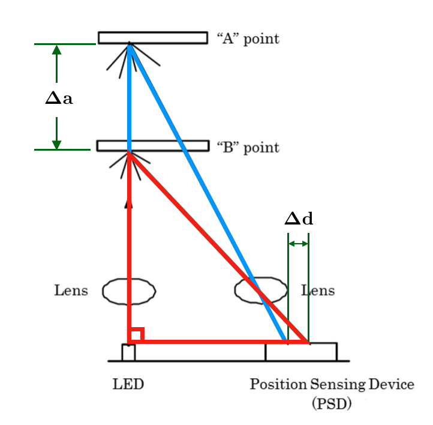

# Calibration {#sac2-sensing-calibration status=ready}

## Background

In the Build Part 2 Checkpoint, you read the output of your IR sensor using two methods. First, you used the multimeter to read the voltage of the IR sensor signal wire. Then, you started up the drone software and observed the IR sensor readings on the height chart. In this lesson, you will implement the steps needed to transform the voltage output in Volts to a distance in meters.

## How the IR sensor works

If you take a close look at the IR sensor, you might think that it looks as if it has two eyes. One of these "eyes" is used to emit light, and the the other is used to detect light. In slightly more detail, the IR sensor works by emitting a beam of infrared light out of an infrared LED on one side of the IR sensor, and then measuring reflection using a special sensor on the other side. The sensor that measures the reflected light is called a Position Sensing Device (PSD), and it outputs a voltage that depends on where the light is hitting the sensor. If you would like a more detailed explanation, read the "How does an IR sensor work?" section of [this article](https://www.makerguides.com/sharp-gp2y0a21yk0f-ir-distance-sensor-arduino-tutorial/).

Although we know that the PSD outputs a voltage related to the position of the reflected light, we do not know what the relationship is. There are three ways that we can determine the relationship. The first is looking at the sensor _datasheet_. The second is by experimentation, and the third is by geometrical derivation.

## Datasheet

A datasheet is a document that is created by the designer of some piece of technology that includes all of the information about the device. The information will vary depending on the device, but generally it will include the correct operating conditions, the limits of the device, and graphs of the devices performance.

### Read through

[Here is the datasheet](https://www.parallax.com/sites/default/files/downloads/28995-Sharp-GP2Y0A21YK0F-IR-Datasheet.pdf) for your Sharp IR sensor. Give it a brief read to become acquainted with the document, it is OK not to understand everything; some of the information is application dependent.

1. The first includes descriptions of the device, features, an some example applications.

1. The second page includes technical drawings with dimensions so that we can design our robot to accomodate the sensor.

1. The third page has information on the electrical characteristics of the sensor such as the sensor output on different surfaces.

1. The fourth page shows the timing diagram (very low-level circuit design information) that shows how fast new sensor measurements are available.

1. The fifth page shows the relationship between the output voltage and the distance to an object. This is just what we were trying to find!

### Looking at the graphs

Take a look at the graphs in Fig. 2. In the next section, you will be creating these graph for yourself!

**Top graph**
The top graph shows the voltage output of the sensor at different distances. If you are given a distance, you can tell what the voltage output will be by looking at the _y_ value of the graph. For example, if the sensor is at 60 cm, the voltage would be about 0.5 V. However, we want to know the distance given the voltage. If we were given a voltage, such as 1.0 V, there are two possible distance values on the graph: approximately 1 cm and 27 cm. If you look back at the first page of the datasheet, it says that the range of the sensor is between 10-80 cm. This means that we cannot trust the values of the sensor if it is less than 10cm away from an object. If we ignore the part of the graph before 10cm, then we know that if we are given 1.0 V from the IR sensor, then the distance must be 27cm.

**Bottom graph**
The bottom graph show the voltage output of the sensor versus the inverse of the distance.

Q: Why did they make a graph of inverse distance?

Hint: Look at the shape of the graph

Answer: The reason this graph uses the inverse distance is because it _linearizes_ the graph. In the top graph, we see that the voltage is _inversely_ related to the distance. By graphing the voltage against the inverse distance, we can make the graph look like a line. The advantage of linearizing is so that we can approximate any value using the equation of a line: $y = m \cdot x + b$. The following section includes more information on linearizing and inverse relationships.

## Experimental derivation {#sensing-calibration-experimental}

The easiest way to derive the relationship between the IR sensor voltage and distance is to experiment. For this experiment, we are going to move the IR sensor to a known distance from an object, and then we are going to record the voltage output. We will repeat these steps several times between 1cm and 100 cm. Then we will plot the data to visualize the relationship between the two quantities. We've created a spreadsheet for you to enter your data. Open [this spreadsheet](https://docs.google.com/spreadsheets/d/1MMzOZZ6ctoP5_CLTsk6j9O3X2ERI_F9tisQYeAsObgk/edit?usp=sharing) and click: File > make a copy.

### Collect Data

Gather your drone build and and a meter stick. Hold the meter stick up, or lean it against a wall. Face the sensor at  1 cm above the ground and use the multimeter to measure the voltage, as was done in Build Part 2 Checkpoint. Record the voltage in the spreadsheet column titled "Voltage (V)". Repeat this step for each distance measurement.

### Analyze the Data

Figure 1 is a scatter plot that compares the voltage output from the sensor to the distance from the ground. Take a look at one of the data points on the plot. Notice that the _x_ value is the distances that you measured at, and the _y_ value is the voltage output that you recorded. We can use this plot to get the distance from the voltage. However, what happens if we are given a voltage that is not one of our data points? For example, we know the voltages at 40cm and 50cm, but what if the drone is at 45cm?

### Interpolate

Although we do not know what the voltage will be in-between our data points, we can approximate it using nearby data points. For our approximation, we can perform a _linear interpolation_ between data points. Linear interpolation sounds fancy, but all it means is to play connect-the-dots with our graph; that is, we draw a straight line between each point. Figure 2 shows what the graph looks like with linear interpolation. Notice that between each point is a straight line (if the line was curved, it would not be **linear** interpolation).

Now that we know what the data is in-between points, let's try working with it again!

### Understand the data

Now that we have interpolated between points, we can use this graph to find the distance given any voltage. Let's try it.

1. Hold your sensor above the ground at any distance between 10 and 80cm. Write down the distance somewhere.

2. Read the voltage using the multimeter

3. Look at the graph and find this voltage on the y-axis

4. Follow the graph straight down to the x-axis to find the distance that corresponds to this voltage

5. Check: was the distance that you got from the graph close to what you wrote down?

This is how the IR sensor can measure distances! But there is a bit of a problem.

Q: What happens if try to follow the same steps when the IR sensor is only 5 cm above the ground?

A: There are two possible distances for this voltage value! If we were only given the voltage value and asked to find the distance, we wouldn't know which one to choose!

### Set limits

There is an easy solution to the problem we've just discovered. Let's cut out any part of the graph that has two distance values for one voltage value. It looks like if we remove all of the data before 10 cm (value may vary depending on your data), we can eliminate our problem. This is what was recommended earlier in the sensor datasheet.

Q: Do you see the disadvantage to ignoring the data below 10cm?

Answer: We cannot trust any of the sensor measurements that are less than 10cm. This is unfortunate, but since the drone will always be flying above this height, this will only be a problem during the takeoff. (The solution is to take off a little fast so that we are not flying below 10cm for long.)

The new graph of our data is shown in Figure 3. Notice that if you were to draw a horizontal line across the graph, it will never cross the voltage graph twice unlike before.
This is called the "horizontal line test" and it means that all of the y-values have only one x-value. In other words, we never have the issue of choosing between two distance values. We also know that we can't trust our measurements until the sensor is at least 10cm off of the ground.

### Linearize the graph

With our latest graph (Figure 3), we can be given a voltage and then we can find the distance. However, it is clear that our linear interpolation is a very rough approximation of the graph. In reality, there are no straight lines between data points, the graph is curved, and if we take more data points, then we will be able to see this better. The more data points that we have, the less we have to approximate between two values. But adding more and more data points is tedious, and we don't know how many we need to add to make the drone fly well. It would be nice if there were a better way...

And there is! The solution is to linearize the graph. Linearizing the graph means manipulating the data so that follows a line. A linear graph is easy to work with because it can be easily approximated using the equation for a line:

\[
y = m \cdot x + b
\]

where $m$ is the slope (rise over run) and $b$ is the intercept (where the graph crosses the y axis). In our case, we want:

\[
  \textrm{voltage} = m \cdot f(\textrm{distance}) + b
\]

In the equation above, $x$ is a function of distance:

\[
  x = f(\textrm{distance})
\]

These formulas are equivalent:

\[
  \textrm{voltage} = y = m \cdot x + b = m \cdot f(\textrm{distance}) + b
\]

Because of the shape of our data in the Figs.1 and 2, we can assume that the distance is _inversely_ related to the voltage. Mathematically, an inverse relationship is defined as:

\[
y \propto \frac{1}{x}
\]

or

\[
y = c \cdot \frac{1}{x}
\]

Where the $\propto$ symbol means "proportional to", and $c$ is some constant.

The graph of an inverse relationship looks like:

<figure>
    <figcaption>Inverse Relationship</figcaption>
    
</figure>

 Now that we have assumed the relationship is inverse, and have verified it by comparing the shapes of our graph and the graph of an inverse relationship, we can linearize the graph. To linearize the graph, instead of comparing voltage to distance, we can compare voltage to the inverse of the distance, or $\frac{1}{\textrm{distance}}$. The new graph that we get is shown in Figure 4 on the spreadsheet. Notice that our data points look like a line! We can define $x$ as:

 \[
    x = f(\textrm{distance}) = \frac{1}{\textrm{distance}}
 \]

### Best fit line

Now that the data looks like linear, we can draw a best-fit line that is a _linear approximation_ of the data. Figure 5 shows the best fit line drawn, and the legend has the equation for the line. We can find the values for m and b from the equation of the best fit line shown in Figure 5.

The one catch is that right now the line shown is

\[
  \textrm{voltage} = m \cdot \frac{1}{\textrm{distance}} + b
\]

We need to rearrange the equation to solve for distance:

\[
  \textrm{distance} = \frac{m}{\textrm{voltage} - b}
\]

Now we can find any distance given the voltage! All we have to do is find $\frac{1}{\textrm{voltage}}$ and then plug this value into the formula above!

If you would like another example of linearizing graphs, watch this [video tutorial](https://www.youtube.com/watch?v=LqKmjMRtxkA)

## Geometrical derivation

It is possible to geometrically derive the relationship between the IR sensor output voltage and the distance to an object. Using the diagram from [this article](https://www.makerguides.com/sharp-gp2y0a21yk0f-ir-distance-sensor-arduino-tutorial/), the geometry of the sensor looks like this image:

<figure>
    <figcaption>IR sensor geometry</figcaption>
    
</figure>

There are a few measurements in this diagram that do not change for different distance readings. The fixed objects are the LED, the lenses, and the PSD. We can use this information to overlay triangles on top of this image for each of the measurements to simplify the geometry.

The two quantities we want to relate are the distance to the object (point A or B in the image), and the position on the PSD.

Let's create a triangle that relates the distance to an object to the position of the reflected beam. The height will be determined by the distance to an object, and the base is determined by the position of the reflected beam.

<figure>
    <figcaption>Relate Object Distance to Beam Reflection</figcaption>
    
</figure>

This triangle is a _right triangle_ , meaning that it contains one _right angle_ (a 90 degree angle). The right angle is indicated by the box in the lower left corner. Generally, right triangles are easier to work with because one of the angles is always constrained to 90 degrees.

Let's take a look at another right triangle drawn for the object that is further away.

<figure>
    <figcaption>Triangle relation for further object</figcaption>
    
</figure>

Q: Can you identify how the height and base changes as the object is further away?

Answer: The further away the object is, the greater the height, and the closer the reflected beam is to the left. Equivalently, as the height of the triangle increases, the length of the base decreases.

Recall that our goal is to measure the height of the triangle. We have found that there is some sort of relation between height and base; however we have no method of measuring either. What we are able to measure is the position of the reflected beam on the PSD. We also know that the distance from the PSD to the Lens in front of it is always the same. Let's draw another triangle that has a height determined by the the distance to the lens (a quantity that we can measure), and a base determined by the position of the reflected beam on the PSD (another quantity that we can measure). Let's take a look at this new triangle in addtion to the first one that we drew:

<figure>
    <figcaption>Relate Distance to Lens to Beam Reflection</figcaption>
    
</figure>

This diagram has labels at each vertex. Segment p_1 to p_2 is the distance to the object. Segment p_2 to p_4 is the distance to the reflected beam from the LED. Segment p_3 to p_4 is the distance to the reflected beam from the PSD. Segment p_3 to p_5 is the distance to the lens.

Let's remove the diagram to make the geometry easier to see:

<figure>
    <figcaption>Relate Distance to Lens to Beam Reflection</figcaption>
    
</figure>

In the above image, we've removed the diagram, as well as labeled the sides of the triangles:

- A (p_1 to p_2): distance to object (height of bigger triangle)
- B (p_2 to p_4): distance to reflected beam from the LED (base of bigger triangle)
- C (p_3 to p_5): distance to lens above the PSD (height of smaller triangle)
- D (p_3 to p_4): distance to reflected beam from the PSD (base of smaller triangle)

There is a special characteristic about the two triangles in the above image: they are _similar_. Similar triangles have a unique property that will help us determine the relationship between the position of the reflected beam on the PSD and the distance to the object. The property is that the ratio between corresponding sides of similar triangles are the same. This property tells us that

\[
  \frac{A}{B} = \frac{C}{D}
\]

Now that we have one equation for our one unknown value, we can find A! Let's review what we know:

- C: fixed distance to lens
- D: Value that is given to us by the PSD
- B: fixed distance from p_2 to p_3 plus the value of D

Let's rearrange the similar triangle formula to find our unknown value:

\[
  A = \frac{C}{D} \cdot B
\]

From this equation, we see that length of side D is inversely proportional to the length of side A. This means that the voltage reading from the PSD will be inversely related to the distance to the object. Let's take a look at the two example objects and see if this makes sense:

<figure>
    <figcaption>Inverse Relation</figcaption>
    
</figure>

Let's say that at first our sensor was looking at "B" point in this diagram. Then, let's say that the object moved further away and is now at "A" point. We can see that the change in height, shown by $\Delta a$, of the big triangle is positive (the length increased) and relatively large; meanwhile, the change in length of the base, shown by $\Delta d$, is negative (the length decreased) and relatively small. What we've observed is that as the distance to an object increases by a lot, the distance from the PSD to the reflected beam decreases a little bit.

Based on our findings, an inverse relationship makes sense. As the object distance increases by a large amount, the reflected beam distance decreases by a small amount.

Now that we have proved geometrically, and verified analytically, that the distance to an object is inversely related to the PSD measurement, we are only a few steps away from converting the output of the IR sensor to a distance measurement in meters. Follow the [experimental calibration](#sensing-calibration-experimental) steps to find the proportionality constant, $c$, of the inverse relationship.

**Proof of similarity**

We can prove that the two triangles are similar by proving that two angles are congruent. We know that the bottom left angles of each triangle are congruent because they are both right angles. This was easy because we drew the triangles this way. We also know that the bottom right angles of both triangles are the same because we drew the smaller triangle inside of the bigger one and both triangles share this angle. Since two corresponding angles are the same, so are the third angles. Therefore, these triangles are similar.
